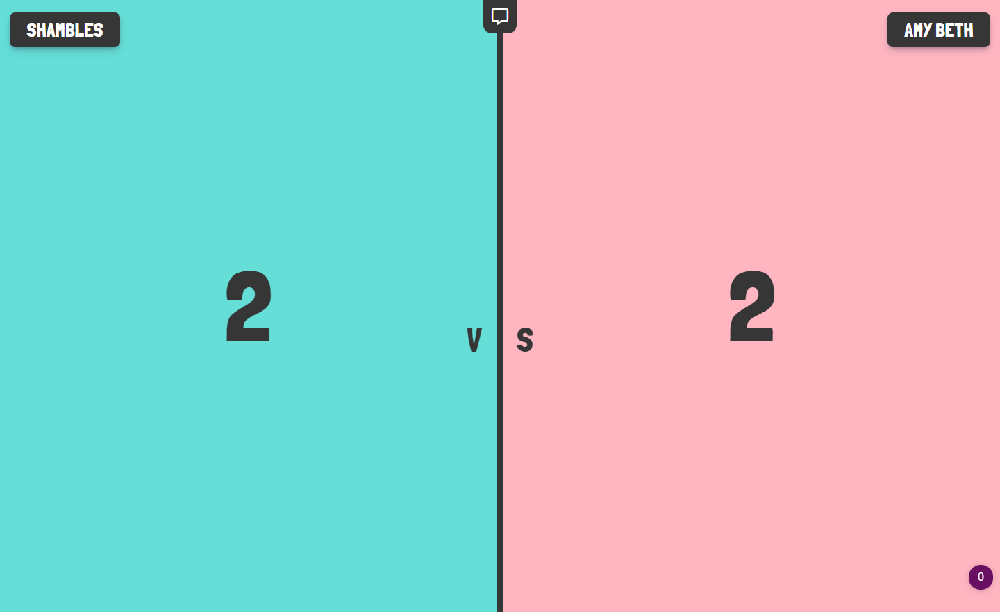

<h1>The Amethyst Project</h1>

  This website is a scoreboard of the best, silly (random) messages sent each day. The messages are sent by two people and uploaded to a firebase database.
  
  This is a random little project made with love by both myself and a friend. 
  
  The initial objective of this project was to help teach a friend by building a website. 

<!-- REPLACE HREFS -->

<!-- REPLACE TASKS -->
<h2>Future Development</h2>
We plan on re-visiting this project as we both grow our skills as developers.

Here are a few additions we plan on implementing in the near future...

Planned Features:
- [ ] A Quote register of favourited quotes each day.
- [ ] Message container auto-scrolls to the top.
- [ ] Login system to upload messages to the database.

<!-- IMAGE MAY NEED REPLACING -->

<!-- UPDATE ENTIRE SECTION -->
<h2>Tools</h2>

  
  
  
  
  
  

  
<!--  Thank you for taking the time to review my projects!  -->
